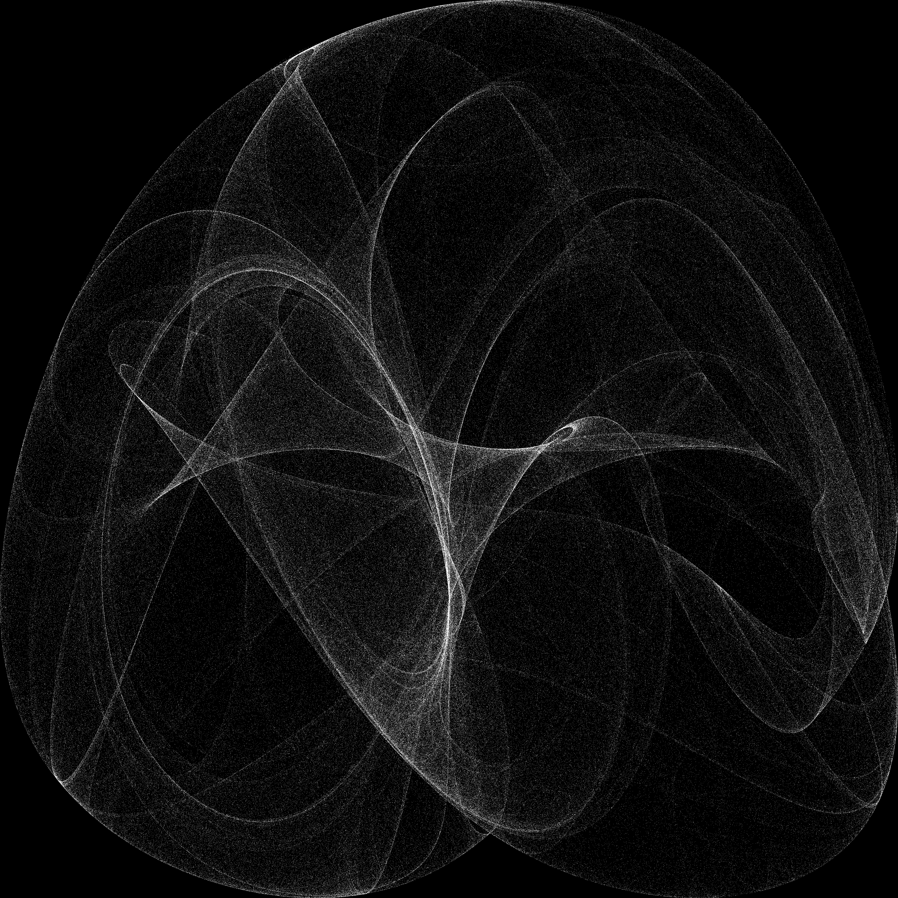

# Peter De Jong Attractor

Peter De Jong:

    x[n+1] = sin(a * y[n]) - cos(b * x[n])
    y[n+1] = sin(c * x[n]) - cos(d * y[n])

    a,b,c,d belong to [-3,3]
    x,y belong to [-2,2]

PHP:

    function getNextPoint($x, $y, $a, $b, $c, $d)
    {
        $xNext = sin($a * $y) - cos($b * $x);
        $yNext = sin($c * $x) - cos($d * $y);
        return [$xNext, $yNext];
    }

Generate data:

    $a = mt_rand() / mt_getrandmax() * 6 - 3;
    $b = mt_rand() / mt_getrandmax() * 6 - 3;
    $c = mt_rand() / mt_getrandmax() * 6 - 3;
    $d = mt_rand() / mt_getrandmax() * 6 - 3;
    $data = [];
    $data[] = [0, 0];
    for ($i = 1; $i < 10; $i++) {
        list($x, $y) = $data[$i - 1];
        $data[] = getNextPoint($x, $y, $a, $b, $c, $d);
    }
    print_r($data);

Draw:

    class Image
    {
        private $path;
        private $gd;
        private $color;

        public function __construct($path)
        {
            $this->gd = imagecreate(4000, 4000);
            imagecolorallocate($this->gd, 0, 0, 0);
            $this->color = imagecolorallocate($this->gd, 255, 255, 255);
            $this->path = $path;
        }

        public function draw($x, $y)
        {
            imagesetpixel($this->gd, intval(1000 * $x + 2000), intval(1000 * $y + 2000), $this->color);
        }

        public function save()
        {
            imagepng($this->gd, $this->path);
        }
    }

Generate data and save:

    $x = mt_rand() / mt_getrandmax() * 4 - 2;
    $y = mt_rand() / mt_getrandmax() * 4 - 2;
    $a = mt_rand() / mt_getrandmax() * 6 - 3;
    $b = mt_rand() / mt_getrandmax() * 6 - 3;
    $c = mt_rand() / mt_getrandmax() * 6 - 3;
    $d = mt_rand() / mt_getrandmax() * 6 - 3;

    $image = new Image('Peter_De_Jong.png');
    $data = [$x, $y];
    for ($i = 1; $i < 1000000; $i++) {
        list($x, $y) = $data;
        $image->draw($x, $y);
        $data = getNextPoint($x, $y, $a, $b, $c, $d);
    }
    $image->save();

Please run this command:

    php main.php

Look:

